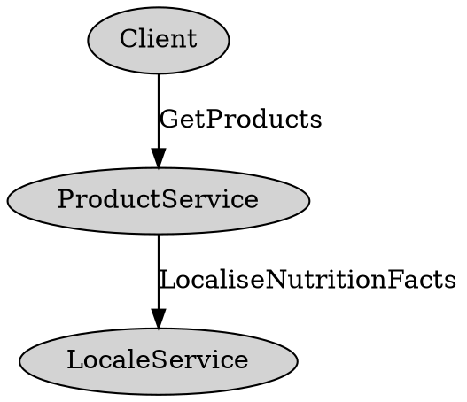

+++
title = "API ベストプラクティス"
weight = 100
description = "将来に耐える API を作成するのは意外と難しいです。この文書の提案は、長期的でバグのない進化を重視するためにトレードオフを行います。"
type = "docs"
+++

proto3 用に更新されました。パッチは歓迎します！

この文書は、[Proto ベストプラクティス](/programming-guides/dos-donts) の補足です。
これは Java/C++/Go などの API の指示書ではありません。

コードレビューでこれらのガイドラインから逸脱する proto を見つけた場合は、
著者にこのトピックを指摘し、情報を広める手助けをしてください。

{}
これらのガイドラインはあくまでそれであり、多くの例外が文書化されています。たとえば、
パフォーマンス重視のバックエンドを書いている場合、柔軟性や安全性を犠牲にして速度を重視するかもしれません。
このトピックは、トレードオフをよりよく理解し、状況に適した決定をするのに役立ちます。{}

## フィールドとメッセージを正確かつ簡潔に文書化する {#precisely-concisely}

おそらく、あなたの proto は、あなたがそれを書いたり変更したときに考えていたことを知らない人々によって継承され、使用されるでしょう。
各フィールドを、あなたのシステムの知識が少ない新しいチームメンバーやクライアントにとって有用な用語で文書化してください。

具体的な例：

```proto
// Bad: Option to enable Foo
// Good: Configuration controlling the behavior of the Foo feature.
message FeatureFooConfig {
  // Bad: Sets whether the feature is enabled
  // Good: Required field indicating whether the Foo feature
  // is enabled for account_id.  Must be false if account_id's
  // FOO_OPTIN Gaia bit is not set.
  optional bool enabled;
}

// Bad: Foo object.
// Good: Client-facing representation of a Foo (what/foo) exposed in APIs.
message Foo {
  // Bad: Title of the foo.
  // Good: Indicates the user-supplied title of this Foo, with no
  // normalization or escaping.
  // An example title: "Picture of my cat in a box <3 <3 !!!"
  optional string title [(max_length) = 512];
}

// Bad: Foo config.
// Less-Bad: If the most useful comment is re-stating the name, better to omit
// the comment.
FooConfig foo_config = 3;
```

各フィールドの制約、期待値、解釈を可能な限り簡潔に文書化してください。

カスタム proto アノテーションを使用することができます。
上記の例のように、`max_length` のようなクロス言語定数を定義するには、
[カスタムオプション](/programming-guides/proto2#options) を参照してください。
proto2 および proto3 でサポートされています。

インターフェースの文書化は時間とともに長くなることがあります。その長さは明瞭さを損ないます。
文書化が実際に不明確な場合は修正してくださいが、
全体的に見て簡潔さを目指してください。

## ワイヤーとストレージ用に異なるメッセージを使用する {#use-different-messages}

クライアントに公開するトップレベルの proto がディスクに保存するものと同じである場合、問題が発生します。
時間の経過とともに、ますます多くのバイナリがあなたの API に依存するようになり、変更が難しくなります。
クライアント proto、ストレージ proto、または変換のいずれかを扱うモジュールにコードをレイヤ化してください。


なぜかというと、基礎となるストレージシステムを交換したいかもしれません。データを正規化したり非正規化したりしたいかもしれません。クライアントに公開される proto の一部を RAM に保存することが合理的である一方、他の部分はディスクに保存することが合理的であることに気づくかもしれません。

トップレベルのリクエストまたはレスポンス内に1つ以上のレベルでネストされた proto に関しては、ストレージ proto とワイヤー proto を分離する理由はそれほど強くなく、クライアントをそれらの proto にどれだけ密接に結びつけるかに依存します。

翻訳レイヤーを維持するコストはかかりますが、最初のストレージ変更を行う際にすぐにペイオフします。

必要に応じてプロトを共有して分岐することに誘惑されるかもしれません。分岐に高いコストを感じ、内部フィールドを配置する明確な場所がない場合、API はクライアントが理解しないフィールドを蓄積したり、知識を持たずに依存したりする可能性があります。

別々の proto ファイルから始めることで、チームは内部フィールドを追加する場所を知り、API を汚染することなく進めることができます。初期段階では、ワイヤー proto は自動翻訳レイヤー（バイトコピーまたは proto リフレクションなど）とタグごとに同一であることができます。Proto アノテーションも自動翻訳レイヤーをサポートできます。

以下はルールの例外です：

*   proto フィールドが `google.type` または `google.protobuf` のような共通のタイプの1つである場合、そのタイプをストレージと API の両方で使用することは許容されます。
*   サービスが非常にパフォーマンスに敏感である場合、柔軟性を実行速度と引き換えにする価値があるかもしれません。サービスがミリ秒単位の遅延で数百万の QPS を持っていない限り、おそらく例外ではありません。
*   すべての以下が真である場合：

    *   あなたのサービスはストレージシステムである
    *   あなたのシステムはクライアントの構造化データに基づいて決定を行わない
    *   あなたのシステムは単にクライアントのリクエストに応じてデータを保存し、読み込み、おそらくクエリを提供する

    ロギングシステムや一般的なストレージシステムの周りに proto ベースのラッパーを実装している場合、クライアントのメッセージができるだけ不透明にストレージバックエンドに移行するようにすることで、依存関係のネクサスを作成しないようにすることが望ましいかもしれません。拡張機能や[Web セーフ エンコーディングによる文字列内の不透明データのエンコード](/programming-guides/api#encode-opaque-data-in-strings)を使用することを検討してください。

## 変更操作において、部分的な更新または追加のみの更新をサポートし、完全な置換をサポートしない {#support-partial-updates}

`Foo` のみを取る `UpdateFooRequest` を作成しないでください。

クライアントが未知のフィールドを保持しない場合、`GetFooResponse` の最新のフィールドを持たないため、ラウンドトリップでデータが失われる可能性があります。一部のシステムは未知のフィールドを保持しません。Proto2 および proto3 の実装は、アプリケーションが未知のフィールドを明示的に削除しない限り、未知のフィールドを保持します。一般的に、公開APIでは未知のフィールドをサーバーサイドで削除して、未知のフィールドを介したセキュリティ攻撃を防ぐべきです。たとえば、ゴミのような未知のフィールドが将来の新しいフィールドとして使用されると、サーバーが失敗する可能性があります。

文書がない場合、オプションフィールドの処理は曖昧です。`UpdateFoo` はフィールドをクリアしますか？その場合、クライアントがそのフィールドについて知らないとデータが失われる可能性があります。フィールドに触れないのですか？その場合、クライアントはフィールドをクリアする方法はありませんか？どちらも良い方法ではありません。

### 修正方法1: Update Field-mask を使用する {#use-update-field-mask}

クライアントに修正したいフィールドを渡し、更新リクエストにはそのフィールドのみを含めます。サーバーは他のフィールドをそのままにして、マスクで指定されたフィールドのみを更新します。
一般的に、マスクの構造はレスポンスプロトの構造を反映すべきです。つまり、`Foo` が `Bar` を含む場合、`FooMask` は `BarMask` を含むべきです。

### 修正方法2: 個々の部分を変更するより狭い変更を公開する {#expose-more-narrow-mutations}

たとえば、`UpdateEmployeeRequest` の代わりに、`PromoteEmployeeRequest`、`SetEmployeePayRequest`、`TransferEmployeeRequest` などがあります。

カスタムの更新メソッドは、非常に柔軟な更新メソッドよりも監視、監査、セキュリティが容易です。また、実装や呼び出しも簡単です。*多く*のメソッドは、APIの認知負荷を増加させる可能性があります。

## プリミティブ型をトップレベルのリクエストまたはレスポンスプロトに含めないでください {#dont-include-primitive-types}

このルールによって、このドキュメントの他の場所で説明されている多くの落とし穴が解決されます。
たとえば：

繰り返しフィールドがストレージに設定されていないことをクライアントに伝えるか、この特定の呼び出しで設定されていないことを伝えることは、繰り返しフィールドをメッセージでラップすることで行うことができます。

共通のリクエストオプションは、このルールに従うことで自然に共有されます。読み取りおよび書き込みフィールドマスクは、このルールから派生します。

トップレベルの proto はほとんど常に、独立して成長できる他のメッセージのコンテナであるべきです。

今日は単一のプリミティブ型しか必要としない場合でも、それをメッセージでラップすることで、その型を拡張し、同様の値を返す他のメソッド間でその型を共有する明確な経路が得られます。例えば：

```proto
message MultiplicationResponse {
  // Bad: What if you later want to return complex numbers and have an
  // AdditionResponse that returns the same multi-field type?
  optional double result;


  // Good: Other methods can share this type and it can grow as your
  // service adds new features (units, confidence intervals, etc.).
  optional NumericResult result;
}

message NumericResult {
  optional double real_value;
  optional double complex_value;
  optional UnitType units;
}
```

トップレベルのプリミティブの例外：サーバーでのみ構築および解析される不透明な文字列（またはバイト）。継続トークン、バージョン情報トークン、および ID は、実際に構造化された proto のエンコーディングである場合にのみ文字列として返される可能性があります。

## 2 つの状態を持つものにブール値を使用しない {#never-use-booleans-for-two-states}

フィールドにブール値を使用している場合は、そのフィールドが確かに常に 2 つの可能な状態を表していることを確認してください（現在だけでなく、将来も含む）。しばしば、列挙型、int、またはメッセージの柔軟性がそれに値することがわかります。

例えば、投稿のストリームを返す際、開発者は UX の現在のモックに基づいて、投稿を 2 列にレンダリングするかどうかを示す必要があるかもしれません。今日必要なのはブール値だけですが、将来のバージョンで 2 行の投稿、3 列の投稿、または 4 つの正方形の投稿を導入する可能性があります。

```proto
message GooglePlusPost {
  // Bad: Whether to render this post across two columns.
  optional bool big_post;

  // Good: Rendering hints for clients displaying this post.
  // Clients should use this to decide how prominently to render this
  // post. If absent, assume a default rendering.
  optional LayoutConfig layout_config;
}

message Photo {
  // Bad: True if it's a GIF.
  optional bool gif;

  // Good: File format of the referenced photo (for example, GIF, WebP, PNG).
  optional PhotoType type;
}
```

列挙型に状態を追加する際は注意してください。

状態が列挙型に新しい次元を導入するか、複数のアプリケーションの動作を示唆する場合、おそらく別のフィールドが必要です。

## ID に整数フィールドをほとんど使用しない {#integer-field-for-id}

オブジェクトの識別子として int64 を使用することは魅力的ですが、代わりに文字列を選択してください。

これにより、必要に応じて ID スペースを変更でき、衝突の可能性が低下します。2^64 は以前ほど大きくありません。

また、クライアントがそれを不透明なブロブとして扱うように促すために、構造化された識別子を文字列としてエンコードすることもできます。まだ文字列をバックアップする proto が必要ですが、proto を文字列フィールドにシリアライズできます（Web セーフな Base64 としてエンコードされます）、これによりクライアントに公開される API から内部の詳細が削除されます。この場合は、以下のガイドラインに従ってください：[以下](#encode-opaque-data-in-strings)。

```proto
message GetFooRequest {
  // Which Foo to fetch.
  optional string foo_id;
}

// Serialized and websafe-base64-encoded into the GetFooRequest.foo_id field.
message InternalFooRef {
  // Only one of these two is set. Foos that have already been
  // migrated use the spanner_foo_id and Foos still living in
  // Caribou Storage Server have a classic_foo_id.
  optional bytes spanner_foo_id;
  optional int64 classic_foo_id;
}
```

自分自身のシリアル化スキームを使用して、IDを文字列で表現する場合、すぐに奇妙なことが起こる可能性があります。そのため、通常は文字列フィールドをバックアップする内部 proto から始めるのが最善です。

## クライアントが構築または解析することを期待する文字列にデータをエンコードしない {#dont-encode-data-in-a-string}

これは、ワイヤーを介して効率が悪く、proto の消費者にとってはより多くの作業が必要で、ドキュメントを読む人にとっては混乱を招きます。クライアントはエンコーディングについても考えなければなりません: リストはカンマで区切られていますか？この信頼できないデータを正しくエスケープしましたか？数字は基数10ですか？クライアントが実際のメッセージまたはプリミティブ型を送信する方が良いです。ワイヤーを介してよりコンパクトで、クライアントにとってもより明確です。

特に、サービスが複数の言語でクライアントを取得する場合、それぞれが適切なパーサーまたはビルダーを選択しなければならなくなります。または、さらに悪いことに、自分で作成しなければなりません。

一般的に、適切なプリミティブ型を選択してください。[Protocol Buffer Language Guide](/programming-guides/proto2#scalar) の Scalar Value Types テーブルを参照してください。

### フロントエンド Proto で HTML を返す {#returning-html}

JavaScript クライアントでは、API のフィールドに HTML または JSON を返すことが魅力的に見えるかもしれません。これは、API を特定の UI に結びつける滑りやすい坂になります。次の3つの具体的な危険があります:

*   "手作り" の非 Web クライアントは、望むデータを取得するために HTML または JSON を解析することになり、フォーマットを変更した場合には脆弱性が生じ、解析が不十分な場合には壊れやすくなります。
*   Web クライアントは、返された HTML が無加工で返された場合、XSS 攻撃に対して脆弱になります。
*   返されるタグとクラスは特定のスタイルシートと DOM 構造を想定しています。リリースごとにその構造が変わり、JavaScript クライアントがサーバーよりも古い場合、サーバーが返す HTML が古いクライアントで正しくレンダリングされなくなる可能性があります。頻繁にリリースするプロジェクトでは、これはエッジケースではありません。

初期のページ読み込み以外では、データを返し、クライアント側のテンプレートを使用してクライアント上で HTML を構築する方が通常は良いです。

## 文字列に不透明データをWebセーフエンコーディングバイナリProtoシリアライゼーションでエンコード {#encode-opaque-data-in-strings}

もしクライアントが見る可能性のあるフィールド（継続トークン、シリアライズされたID、バージョン情報など）に*不透明*データをエンコードする場合は、クライアントがそれを不透明なブロブとして扱うようにドキュメント化してください。*これらのフィールドには、テキスト形式や独自の形式ではなく、常にバイナリProtoシリアライゼーションを使用してください。* 不透明フィールドにエンコードされたデータを拡張する必要がある場合、既にそれを使用していない場合は、プロトコルバッファシリアライゼーションを再発明することになります。

不透明フィールドに入るフィールドを保持する内部Protoを定義します（1つのフィールドしか必要がなくても）、この内部Protoをバイトにシリアライズしてから、その結果をWebセーフなベース64エンコードして文字列フィールドに入れます。

Protoシリアライゼーションを使用しない場合の稀な例外：*非常に*まれに、慎重に構築された代替形式からのコンパクトさが勝る場合があります。

## クライアントが絶対に使用しないフィールドを含めない {#dont-include-fields}

クライアントに公開するAPIは、システムとのやり取り方法を説明するためだけにするべきです。それ以外のものを含めると、理解しようとする人に認知的負担がかかります。

応答プロトにデバッグデータを返すことは以前一般的な慣行でしたが、より良い方法があります。RPC応答拡張（または「サイドチャネル」とも呼ばれる）を使用すると、クライアントインターフェースを1つのProtoで、デバッグ用の表面を別のProtoで記述できます。

同様に、応答プロトに実験名を返すことは以前はログ記録の便宜上でした - 書かれていない契約は、クライアントがその実験を後続のアクションで送信するというものでした。同じことを達成する受け入れられる方法は、解析パイプラインでログ結合を行うことです。

1つの例外：

連続してリアルタイムの分析が必要であり、かつ小さなマシン予算である場合、ログ結合を実行することが制限されるかもしれません。コストが決定要因である場合、事前にログデータを非正規化することで利益を得ることができます。ログデータをラウンドトリップして受け取る必要がある場合は、それをクライアントに不透明なブロブとして送信し、リクエストと応答フィールドをドキュメント化してください。

**注意:** *すべて*のリクエストで非表示データを返すかラウンドトリップする必要がある場合、サービスの使用コストを隠している可能性があり、それもよくありません。

## *稀に*継続トークンなしでページネーションAPIを定義する {#define-pagination-api}

```proto
message FooQuery {
  // Bad: If the data changes between the first query and second, each of
  // these strategies can cause you to miss results. In an eventually
  // consistent world (that is, storage backed by Bigtable), it's not uncommon
  // to have old data appear after the new data. Also, the offset- and
  // page-based approaches all assume a sort-order, taking away some
  // flexibility.
  optional int64 max_timestamp_ms;
  optional int32 result_offset;
  optional int32 page_number;
  optional int32 page_size;

  // Good: You've got flexibility! Return this in a FooQueryResponse and
  // have clients pass it back on the next query.
  optional string next_page_token;
}
```

ページネーションAPIのベストプラクティスは、内部プロトによってバックアップされた不透明な継続トークン（`next_page_token`と呼ばれる）を使用し、それをシリアライズしてから `WebSafeBase64Escape`（C++）または `BaseEncoding.base64Url().encode`（Java）します。その内部プロトには多くのフィールドが含まれる可能性があります。重要なのは、これによって柔軟性が得られ、必要に応じてクライアントに安定性が提供されることです。

このプロトのフィールドを信頼できない入力として検証することを忘れないでください（[文字列内の不透明データをエンコードする](#encode-opaque-data-in-strings)の注を参照）。

```proto
message InternalPaginationToken {
  // Track which IDs have been seen so far. This gives perfect recall at the
  // expense of a larger continuation token--especially as the user pages
  // back.
  repeated FooRef seen_ids;

  // Similar to the seen_ids strategy, but puts the seen_ids in a Bloom filter
  // to save bytes and sacrifice some precision.
  optional bytes bloom_filter;

  // A reasonable first cut and it may work for longer. Having it embedded in
  // a continuation token lets you change it later without affecting clients.
  optional int64 max_timestamp_ms;
}
```

## 関連するフィールドを新しいメッセージにグループ化する。高い凝集性を持つフィールドのみをネストする {#group-related-fields}

```proto
message Foo {
  // Bad: The price and currency of this Foo.
  optional int price;
  optional CurrencyType currency;

  // Better: Encapsulates the price and currency of this Foo.
  optional CurrencyAmount price;
}
```

高い凝集性を持つフィールドのみをネストすべきです。フィールドが本当に関連している場合、サーバ内で一緒に渡すことがよくあります。それらがメッセージ内で一緒に定義されていると、それが簡単になります。考えてみてください：

```java
CurrencyAmount calculateLocalTax(CurrencyAmount price, Location where)
```

CLが1つのフィールドを導入する場合でも、そのフィールドに後で関連するフィールドが追加される可能性がある場合は、予防的に独自のメッセージに配置して、次のような状況を避けてください：

```proto
message Foo {
  // DEPRECATED! Use currency_amount.
  optional int price [deprecated = true];

  // The price and currency of this Foo.
  optional google.type.Money currency_amount;
}
```

ネストされたメッセージの問題は、`CurrencyAmount`がAPIの他の場所で再利用される可能性がある一方で、`Foo.CurrencyAmount`が再利用されないかもしれないことです。最悪の場合、`Foo.CurrencyAmount`が再利用されるが、`Foo`固有のフィールドが漏れ込む可能性があります。

[緩やかな結合](https://en.wikipedia.org/wiki/Loose_coupling)は、システムを開発する際のベストプラクティスとして一般的に受け入れられていますが、`.proto`ファイルを設計する際には常に適用されるわけではありません。情報の2つのユニットを（1つをもう一方の内部にネストすることで）緊密に結合することが適切な場合もあります。たとえば、現時点ではかなり汎用的に見えるフィールドセットを作成しているが、後で専門のフィールドを追加することを予想している場合、メッセージをネストすることで、他の場所のこのまたは他の`.proto`ファイルからそのメッセージを参照することを避けることができます。

```proto
message Photo {
  // Bad: It's likely PhotoMetadata will be reused outside the scope of Photo,
  // so it's probably a good idea not to nest it and make it easier to access.
  message PhotoMetadata {
    optional int32 width = 1;
    optional int32 height = 2;
  }
  optional PhotoMetadata metadata = 1;
}

message FooConfiguration {
  // Good: Reusing FooConfiguration.Rule outside the scope of FooConfiguration
  // tightly-couples it with likely unrelated components, nesting it dissuades
  // from doing that.
  message Rule {
    optional float multiplier = 1;
  }
  repeated Rule rules = 1;
}
```

## 読み取りリクエストにフィールド読み取りマスクを含める {#include-field-read-mask}

```proto
// Recommended: use google.protobuf.FieldMask

// Alternative one:
message FooReadMask {
  optional bool return_field1;
  optional bool return_field2;
}

// Alternative two:
message BarReadMask {
  // Tag numbers of the fields in Bar to return.
  repeated int32 fields_to_return;
}
```

推奨される `google.protobuf.FieldMask` を使用すると、`FieldMaskUtil`
([Java](/reference/java/api-docs/com/google/protobuf/util/FieldMaskUtil.html)/[C++](/reference/cpp/api-docs/google.protobuf.util.field_mask_util.md))
ライブラリを使用して、proto を自動的にフィルタリングできます。

読み取りマスクはクライアント側に明確な期待を設定し、クライアントが返されるデータの量を制御し、バックエンドがクライアントが必要とするデータのみを取得できるようにします。

許容される代替手段は常にすべてのフィールドを埋めることです。つまり、すべてのフィールドが true に設定された暗黙の読み取りマスクがあるかのようにリクエストを処理します。この方法は、proto が成長するにつれてコストがかかる可能性があります。

最悪の失敗モードは、メッセージを生成したメソッドによって異なる暗黙の（宣言されていない）読み取りマスクがある場合です。このアンチパターンは、応答 proto からローカルキャッシュを構築するクライアントで明らかなデータ損失を引き起こします。

## 一貫した読み取りを可能にするためにバージョンフィールドを含める {#include-version-field}

クライアントが同じオブジェクトに書き込みを行い、その後読み取りを行う場合、クライアントは書き込んだ内容を取得することを期待します。これは、基礎となるストレージシステムにとって合理的でない期待であってもです。

サーバーはローカル値を読み取り、ローカルの version_info が期待される version_info よりも小さい場合、最新の値を取得するためにリモートレプリカから読み取ります。通常、version_info は、ミューテーションが行われたデータセンターとコミットされたタイムスタンプを含む文字列としてエンコードされた
[proto](#encode-opaque-data-in-strings)です。

一貫したストレージでバックアップされたシステムでも、毎回の読み取りでコストをかけるのではなく、より高価な一貫した読み取りパスをトリガーするトークンが必要な場合があります。

## 同じデータ型を返す RPC に対して一貫したリクエストオプションを使用する {#use-consistent-request-options}

例として、各 RPC が同じデータ型を返すサービスのリクエストオプションが失敗するパターンがありますが、それぞれが最大コメント、サポートされる埋め込みタイプリストなどを指定するための別々のリクエストオプションを持っています。

コストをかけずにアプローチすることのコストは、各リクエストをどのように記入するかを把握することによるクライアントの複雑さと、N個のリクエストオプションを共通の内部オプションに変換することによるサーバーの複雑さが増加します。実際のバグのかなりの数がこの例に起因していることがあります。

代わりに、リクエストオプションを保持する単一の別のメッセージを作成し、トップレベルのリクエストメッセージのそれぞれに含めます。以下はベストプラクティスの例です：

```proto
message FooRequestOptions {
  // Field-level read mask of which fields to return. Only fields that
  // were requested will be returned in the response. Clients should only
  // ask for fields they need to help the backend optimize requests.
  optional FooReadMask read_mask;

  // Up to this many comments will be returned on each Foo in the response.
  // Comments that are marked as spam don't count towards the maximum
  // comments. By default, no comments are returned.
  optional int max_comments_to_return;

  // Foos that include embeds that are not on this supported types list will
  // have the embeds down-converted to an embed specified in this list. If no
  // supported types list is specified, no embeds will be returned. If an embed
  // can't be down-converted to one of the supplied supported types, no embed
  // will be returned. Clients are strongly encouraged to always include at
  // least the THING_V2 embed type from EmbedTypes.proto.
  repeated EmbedType embed_supported_types_list;
}

message GetFooRequest {
  // What Foo to read. If the viewer doesn't have access to the Foo or the
  // Foo has been deleted, the response will be empty but will succeed.
  optional string foo_id;

  // Clients are required to include this field. Server returns
  // INVALID_ARGUMENT if FooRequestOptions is left empty.
  optional FooRequestOptions params;
}

message ListFooRequest {
  // Which Foos to return. Searches have 100% recall, but more clauses
  // impact performance.
  optional FooQuery query;

  // Clients are required to include this field. The server returns
  // INVALID_ARGUMENT if FooRequestOptions is left empty.
  optional FooRequestOptions params;
}
```

## バッチ/マルチフェーズリクエスト {#batch-multi-phase-requests}

可能な限り、変更をアトミックにします。さらに重要なのは、[変更を冪等性にする](#prefer-idempotency)ことです。部分的な失敗の完全なリトライがデータを破損/重複させないようにする必要があります。

時折、パフォーマンス上の理由から複数の操作をカプセル化する単一のRPCが必要になることがあります。部分的な失敗が発生した場合はどうするべきでしょうか？一部が成功し、一部が失敗した場合、クライアントに通知するのが最善です。

RPCを失敗として設定し、成功と失敗の両方の詳細をRPCステータスプロトに返します。

一般的には、部分的な失敗の処理について無知なクライアントでも正しく動作するようにし、部分的な失敗の処理について知っているクライアントには追加の価値を提供することが望ましいです。

## 小さなデータを返すか操作するメソッドを作成し、クライアントにUIをバッチ処理することを期待する {#create-methods-manipulate-small-bits}

単一のラウンドトリップで多くの狭く指定されたデータをクエリできる能力は、クライアントが必要なものを構築できるようにすることで、サーバーの変更なしにより広範囲のUXオプションを提供します。

これは、フロントエンドおよびミドルティアサーバーに最も関連しています。

多くのサービスは独自のバッチ処理APIを公開しています。

## モバイルまたはWeb上でシリアルラウンドトリップが代替手段の場合には、一時的なRPCを作成する {#make-one-off-rpc}

*Webまたはモバイル*クライアントがそれらの間にデータ依存関係を持つ2つのクエリを実行する必要がある場合、現在のベストプラクティスは、クライアントをラウンドトリップから保護する新しいRPCを作成することです。

モバイルの場合、2つのサービスメソッドを1つにまとめて新しいメソッドにまとめることで、ほぼ常にクライアントに余分なラウンドトリップのコストを節約する価値があります。サーバー間の呼び出しの場合、状況は明確でないかもしれません。それは、サービスがどれだけパフォーマンスに敏感であり、新しいメソッドがどれだけ認知的負荷を導入するかに依存します。

## 繰り返しフィールドをスカラーまたは列挙型ではなくメッセージにする {#repeated-fields-messages-scalar-types}

一般的な進化の一例は、単一の繰り返しフィールドが複数の関連する繰り返しフィールドになる必要がある場合です。繰り返しプリミティブから始めた場合、選択肢は限られます。並行して繰り返しフィールドを作成するか、新しいメッセージを定義してその値を保持し、クライアントを移行させるかのどちらかです。

繰り返しメッセージから始めた場合、進化は簡単になります。

```proto
// Describes a type of enhancement applied to a photo
enum EnhancementType {
  ENHANCEMENT_TYPE_UNSPECIFIED;
  RED_EYE_REDUCTION;
  SKIN_SOFTENING;
}

message PhotoEnhancement {
  optional EnhancementType type;
}

message PhotoEnhancementReply {
  // Good: PhotoEnhancement can grow to describe enhancements that require
  // more fields than just an enum.
  repeated PhotoEnhancement enhancements;

  // Bad: If we ever want to return parameters associated with the
  // enhancement, we'd have to introduce a parallel array (terrible) or
  // deprecate this field and introduce a repeated message.
  repeated EnhancementType enhancement_types;
}
```

次の機能要求を想像してみてください。「ユーザーによって実行された強化内容とシステムによって自動的に適用された強化内容を知る必要があります。」

もし`PhotoEnhancementReply`内の強化フィールドがスカラーまたは列挙型であれば、これをサポートするのははるかに難しいでしょう。

これはマップにも同様に適用されます。既にメッセージである場合、マップ値に追加フィールドを追加するのは簡単ですが、`map<string, string>`から`map<string, MyProto>`に移行する必要がある場合よりも簡単です。

例外が1つあります：

レイテンシーが重要なアプリケーションでは、プリミティブ型の並列配列を構築および削除する方が、メッセージの単一配列よりも速くなります。また、[[packed=true]](/programming-guides/encoding#packed)（フィールドタグを省略する）を使用すると、ワイヤー上でより小さくなります。固定数の配列を割り当てる方が、N個のメッセージを割り当てるよりも簡単です。ボーナス：[Proto3](/programming-guides/proto3)では、パッキングが自動的に行われます。明示的に指定する必要はありません。

## Protoマップを使用する {#use-proto-maps}

[Proto3](/programming-guides/proto3)での[Proto3 maps](/programming-guides/proto3#maps)の導入以前、サービスは時々、スカラーフィールドを持つアドホックなKVPairメッセージを使用してデータをペアとして公開していました。最終的にクライアントはより深い構造が必要となり、何らかの方法で解析する必要があるキーまたは値を考案することになります。[文字列にデータをエンコードしない](#dont-encode-data-in-a-string)を参照してください。

そのため、値に（拡張可能な）メッセージ型を使用することは、単純な設計よりも即座に改善されます。

マップはすべての言語でproto2に後方互換性がありましたので、`map<scalar, **message**>`を使用することは、同じ目的のために独自のKVPairを発明するよりも良いです[^3]。

[^3]: `map<k,v>` フィールドを含むプロトの落とし穴。MapReduce でリデュースキーとして使用しないでください。proto3 マップアイテムのワイヤーフォーマットと反復順序は *未指定* であり、これにより一貫性のないマップシャードが生じます。

もし、*予測できない* 構造のデータを表現したい場合は、[`google.protobuf.Any`](/reference/protobuf/textformat-spec#any) を使用してください。

## 冪等性を好む {#prefer-idempotency}

上位のスタックのどこかに、クライアントにリトライロジックがあるかもしれません。リトライがミューテーションである場合、ユーザーは驚かされるかもしれません。重複したコメント、ビルドリクエスト、編集などは誰にとっても良いものではありません。

重複した書き込みを避ける簡単な方法は、クライアントがクライアント作成のリクエスト ID を指定できるようにし、サーバーがそれを重複排除することです（たとえば、コンテンツのハッシュまたは UUID）。

## サービス名を慎重に考え、グローバルに一意にしてください {#service-name-globally-unique}

サービス名（つまり、`.proto` ファイル内の `service` キーワードの後に続く部分）は、サービスクラス名を生成するだけでなく、驚くほど多くの場所で使用されます。これにより、この名前は思っているよりも重要になります。

厄介なのは、これらのツールが暗黙の前提として、サービス名がネットワーク全体で一意であるということです。さらに悪いことに、彼らが使用するサービス名は *修飾されていない* サービス名です（たとえば、`MyService` のようなもの）、修飾されたサービス名ではありません（たとえば、`my_package.MyService` のようなもの）。

この理由から、特定のパッケージ内で定義されている場合でも、サービス名の名前の競合を防ぐための手順を踏むことが理にかなっています。たとえば、`Watcher` という名前のサービスは問題を引き起こす可能性があります。`MyProjectWatcher` のようなものの方が良いでしょう。

## すべての RPC に（寛容な）締め切りを指定して強制してください {#every-rpc-deadline}

デフォルトでは、RPC にはタイムアウトがありません。リクエストがバックエンドリソースを縛り付け、それが完了時にのみ解放される可能性があるため、すべての適切なリクエストが完了することを許可するデフォルトの締め切りを設定することは、良い防御的な慣行です。これを強制しないことは、過去に主要なサービスに深刻な問題を引き起こしたことがあります。RPC クライアントは、出力 RPC に締め切りを設定する必要があり、通常は標準フレームワークを使用する際にデフォルトで行います。締め切りは、リクエストに添付されたより短い締め切りによって上書きされる場合があり、通常はされます。

設定`deadline`オプションは、RPCのデッドラインをクライアントに明確に伝え、標準フレームワークによって尊重され、強制されます。

```proto
rpc Foo(FooRequest) returns (FooResponse) {
  option deadline = x; // 一般的に適切なデフォルトはありません
}
```

デッドライン値の選択は、システムが負荷下でどのように動作するかに特に影響を与えます。既存のサービスの場合、新しいデッドラインを強制する前に既存のクライアントの動作を評価することが重要です（SREに相談してください）。場合によっては、後から短いデッドラインを強制することができないこともあります。

## リクエストとレスポンスサイズの制限 {#bound-req-res-sizes}

リクエストとレスポンスのサイズは制限されるべきです。
おおよそ8 MiB程度の制限を推奨し、2 GiBは多くのプロト実装が壊れる厳しい制限です。
多くのストレージシステムはメッセージサイズに制限を設けています。

また、無制限のメッセージは以下のような問題を引き起こします。

-   クライアントとサーバの両方を膨らませる
-   高く予測不可能な遅延を引き起こす
-   単一のクライアントと単一のサーバ間の長寿命接続に依存することで、回復力が低下する

API内のすべてのメッセージを制限するいくつかの方法は次のとおりです。

-   各RPC呼び出しが論理的に他と独立している、制限されたメッセージを返すRPCを定義する
-   無制限の、クライアント指定のオブジェクトのリストではなく、単一のオブジェクトに対応するRPCを定義する
-   無制限のデータを文字列、バイト、または繰り返しフィールドにエンコードしない
-   長時間実行される操作を定義する。結果をスケーラブルで同時読み取りが可能なストレージシステムに保存する
-   ページネーションAPIを使用する（[継続トークンなしでページネーションAPIを定義しない](#define-pagination-api)を参照）
-   ストリーミングRPCを使用する

UIに取り組んでいる場合は、[小さなデータを返すまたは操作するメソッドを作成する](#create-methods-manipulate-small-bits)も参照してください。

## ステータスコードを慎重に伝播する {#propagate-status-codes}

RPCサービスは、RPCの境界でエラーを調査し、意味のあるステータスエラーを呼び出し元に返すことに注意を払う必要があります。

ポイントを説明するために、おもちゃの例を見てみましょう。

考えてみましょう。`ProductService.GetProducts` を呼び出すクライアントがいるとします。このメソッドは引数を取りません。`GetProducts` の一部として、`ProductService` はすべての製品を取得し、各製品に対して `LocaleService.LocaliseNutritionFacts` を呼び出すかもしれません。



もし `ProductService` が誤って実装されている場合、`LocaleService` に誤った引数を送信する可能性があり、`INVALID_ARGUMENT` が発生します。

もし `ProductService` が軽率にエラーを呼び出し元に返す場合、クライアントは `INVALID_ARGUMENT` を受け取ります。なぜならステータスコードは RPC の境界を越えて伝播するからです。しかし、クライアントは `ProductService.GetProducts` に引数を渡していません。そのため、エラーは無意味以上のものとなり、多くの混乱を引き起こします！

代わりに、`ProductService` は RPC 境界で受け取ったエラーを調査すべきです。つまり、`ProductService` が実装する RPC ハンドラーです。ユーザーに対して意味のあるエラーを返すべきです。もし *呼び出し元から* 無効な引数を受け取った場合は `INVALID_ARGUMENT` を返すべきです。もし *下流の何かから* 無効な引数を受け取った場合は、エラーを呼び出し元に返す前に `INVALID_ARGUMENT` を `INTERNAL` に変換すべきです。

軽率にステータスエラーを伝播させることは混乱を招き、デバッグに非常に高価になる可能性があります。さらに悪いことに、クライアントエラーをすべてのサービスが転送してもアラートが発生しない不可視の障害を引き起こす可能性があります。

一般的なルールは次のとおりです。RPC 境界では、エラーを調査し、適切なステータスコードで呼び出し元に意味のあるステータスエラーを返すように注意を払うべきです。意味を伝えるために、各 RPC メソッドはどのような状況でどのエラーコードを返すかを文書化すべきです。各メソッドの実装は文書化された API 契約に準拠すべきです。

## 各メソッドごとに固有のプロトを作成 {#unique-protos}

各 RPC メソッドごとに固有のリクエストとレスポンスプロトを作成してください。後でトップレベルのリクエストやレスポンスを分岐する必要があることがわかると、それは高価なことです。これには "空" のレスポンスも含まれます。[well-known Empty message type](https://github.com/protocolbuffers/protobuf/blob/main/src/google/protobuf/empty.proto) を再利用する代わりに、固有の空のレスポンスプロトを作成してください。

### メッセージの再利用 {#reuse-messages}

メッセージを再利用するには、複数のリクエストとレスポンスプロトに含めるための共有の "ドメイン" メッセージタイプを作成します。アプリケーションロジックをこれらのタイプに基づいて記述し、リクエストとレスポンスのタイプではなく、これらのタイプに基づいてください。

これにより、メソッドのリクエスト/レスポンスタイプを独立して進化させる柔軟性が得られますが、論理的なサブユニットのコードを共有できます。

## 付録 {#appendix}

### 繰り返しフィールドの返却 {#returning-repeated-fields}

繰り返しフィールドが空の場合、クライアントはそのフィールドがサーバーによって単に設定されていないのか、バッキングデータが実際に空であるのかを区別できません。言い換えれば、繰り返しフィールドには `hasFoo` メソッドがありません。

繰り返しフィールドをメッセージでラップすると、hasFoo メソッドを簡単に取得できます。

```proto
message FooList {
  repeated Foo foos;
}
```

より包括的な解決方法は、フィールドに[読み取りマスク](#include-field-read-mask)を使用することです。フィールドがリクエストされた場合、空のリストはデータがないことを意味します。フィールドがリクエストされていない場合、クライアントはレスポンスのフィールドを無視すべきです。

### 繰り返しフィールドの更新 {#updating-repeated-fields}

繰り返しフィールドを更新する最悪の方法は、クライアントに置き換えリストを提供させることです。クライアントに対して配列全体を提供することで発生する危険は多岐にわたります。未知のフィールドを保持しないクライアントはデータ損失を引き起こします。同時書き込みはデータ損失を引き起こします。これらの問題が当てはまらなくても、クライアントはサーバーサイドでフィールドがどのように解釈されるかを知るために、注意深くドキュメントを読む必要があります。空のフィールドはサーバーが更新しないことを意味するのか、サーバーがクリアすることを意味するのか？

**修正 #1**: クライアントが書き込み時に配列全体を提供せずに、要素を置換、削除、または挿入できる繰り返し更新マスクを使用します。

**修正 #2**: リクエストプロトに別々の追加、置換、削除配列を作成します。

**修正 #3**: 追加またはクリアのみを許可します。これは、繰り返しフィールドをメッセージでラップすることで実現できます。存在するが空のメッセージはクリアを意味し、それ以外の繰り返し要素は追加を意味します。

### 繰り返しフィールドの順序に依存しない {#order-independence-repeated-fields}

一般的に順序依存性を避けてください。これは余分な脆弱性の層です。特に悪い順序依存性のタイプは、並列配列です。並列配列は、クライアントが結果を解釈するのをより難しくし、自分自身のサービス内で関連する2つのフィールドを渡すことを不自然にします。

```proto
message BatchEquationSolverResponse {
  // Bad: Solved values are returned in the order of the equations given in
  // the request.
  repeated double solved_values;
  // (Usually) Bad: Parallel array for solved_values.
  repeated double solved_complex_values;
}

// Good: A separate message that can grow to include more fields and be
// shared among other methods. No order dependence between request and
// response, no order dependence between multiple repeated fields.
message BatchEquationSolverResponse {
  // Deprecated, this will continue to be populated in responses until Q2
  // 2014, after which clients must move to using the solutions field below.
  repeated double solved_values [deprecated = true];

  // Good: Each equation in the request has a unique identifier that's
  // included in the EquationSolution below so that the solutions can be
  // correlated with the equations themselves. Equations are solved in
  // parallel and as the solutions are made they are added to this array.
  repeated EquationSolution solutions;
}
```

### モバイルビルドで Proto が漏洩する機能 {#leaking-features}

Android と iOS のランタイムはどちらもリフレクションをサポートしています。そのため、フィールドやメッセージの未加工の名前がアプリケーションバイナリ（APK、IPA）に文字列として埋め込まれます。

```proto
message Foo {
  // This will leak existence of Google Teleport project on Android and iOS
  optional FeatureStatus google_teleport_enabled;
}
```

いくつかの緩和戦略:

*   Android での ProGuard の難読化。2014 年第 3 四半期現在、iOS には難読化オプションがありません: デスクトップ上で IPA を持っていると、`strings` を通すと含まれる proto のフィールド名が明らかになります。
    [iOS Chrome tear-down](https://github.com/Bensge/Chrome-for-iOS-Headers)
*   モバイルクライアントに送信されるフィールドを厳密に選定する。
*   漏洩を抑制することが受け入れ可能なスケジュールで実現不可能であれば、機能所有者からの承認を得る。

*決して*これをフィールドの意味をコード名で難読化する言い訳に使わないでください。漏洩を抑制するか、リスクを冒すための承認を得てください。

### パフォーマンスの最適化 {#performance-optimizations}

一部のケースでは、パフォーマンス向上のために型の安全性や明瞭さを犠牲にすることができます。例えば、数百のフィールドを持つ proto--特にメッセージ型のフィールド--は、少ないフィールドを持つものよりも解析が遅くなります。非常に深くネストされたメッセージは、メモリ管理からだけでも遅くなる可能性があります。デシリアライズを高速化するためにチームが使用してきたいくつかのテクニック:

*   大きな proto と同様に見えるが、一部のタグのみが宣言された並列のトリムされた proto を作成します。すべてのフィールドが必要ない場合に解析に使用します。トリムされた proto が番号の「穴」を蓄積するにつれて、タグ番号が引き続き一致するようにするためのテストを追加します。
*   フィールドを[[lazy=true]](https://github.com/protocolbuffers/protobuf/blob/cacb096002994000f8ccc6d9b8e1b5b0783ee561/src/google/protobuf/descriptor.proto#L609)として注釈付けします。
*   フィールドをバイトとして宣言し、そのタイプを文書化します。フィールドを解析する必要があるクライアントは、手動で行うことができます。このアプローチの危険性は、誰かが誤ったタイプのメッセージをバイトフィールドに入れることを防ぐものがないことです。ログに書き込まれる proto には決してこれを行ってはいけません。これにより、PII の検証が妨げられたり、ポリシーまたはプライバシーの理由でスクラブされたりします。

Please provide the Markdown content that you would like me to translate into Japanese.
